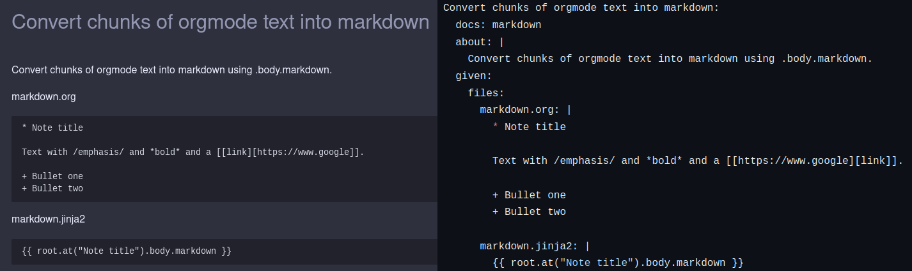

# Specification Documentation Test Triality

Triality is a development and automation process enabled by hitchstory where a *single source of truth* is maintained for specifications, tests and docs.Specifications are executed via a story engine and documentation (e.g. markdown, HTML, etc.) is autogenerated via a template.

This form of automation helps fix three common problems:

- Documentation or specifications are prevented from going out of date. If the behavior changes and the specification isn't updated then the test fails.

- Documentation not being written. If you have a specification you have documentation.

- Less boredom. With triality the most tedious parts of documentation and testing are automated.## Simple real life example

[I built this simple command line app](https://github.com/crdoconnor/orji) to scratch an itch - I wanted to generate a pretty LaTeX letter from the org mode output of [my favorite mobile note taking app](https://f-droid.org/packages/com.orgzly/) without using emacs.

One feature I added to this app was the ability to convert the org mode markup - links, bold, italics, etc. into markdown.

This feature is documented with a [a simple how to page](https://hitchdev.com/orji/using/markdown/). The web page is static HTML, generated using the excellent [mkdocs](https://www.mkdocs.org/) from [a markdown document](https://github.com/crdoconnor/orji/blob/main/docs/public/using/markdown.md) using the mkdos flavor of markdown.

So far, so normal - lots of projects have how to documentation like this.

This markdown document was generated, however, using a combination of [custom jinja2 templates](https://github.com/crdoconnor/orji/blob/main/hitch/docstory.yml) and the [executable specification for this feature](https://github.com/crdoconnor/orji/blob/main/hitch/story/markdown.story) both defined with declarative, type safe YAML.
## Isnt this what Cucumber tried to do?

No.

Firstly, Cucumber wouldn't be used to generate documentation of any kind. It was supposed to be the documentation.

Due to the design of Gherkin's syntax and the culture around the tool it made it difficult produce specifications with complex preconditions and steps. Gherkin stories would often end up looking something like this:

```gherkin
  Scenario: Org file that will produce markdown
    Given I have an org file and appropriate template
    When I run the orji command
    Then an output with markdown will appear
```

Many of the relevant details of the spec would be buried in the step code that was executed.

These "specifications" were ostensibly meant to facilitate conversations, but in practice they were usually ignored by everybody except the testers writing Cucumber scripts.
## Is this tool able to autogenerate all my documentation?

No.

According to the [Diátaxis](https://diataxis.fr/) model there are 4 broad types of documentation necessary for a software project:

- How to
- Reference
- Tutorial
- Explanatory

How to docs will contain a *lot* of overlap with specifications, as will tutorials.

Explanatory docs, however, will contain much less overlap.

Reference material will probably not be generated by hitchstory but may be generated from another source within the code. A good example of this would be REST API reference information generated from a schema.
## What about screenshots?

If the executable specifications are executed something like appium or playwright you can generate screenshot artefacts as a result of running the suite of tests.

The markdown/HTML/whatever documentation generated could then directly reference these files as images.
## What could I use this for?

There are many uses for specification to documentation autogeneration, including:

- Generating how-to docs for your REST API for use by mobile app developers.
- Generating how to docs for a python library (all of the projects on this website are produced this way).
- Generating detailed reports to show to upper management to demonstrate your app's capabilities without requiring a meeting.
- Generating documentation showing all user flows on a multi-language website that can be quality controlled by a translator.
- Generating reports for regulators to demonstrate that an application has undergone rigorous testing.
- ...and much more.


