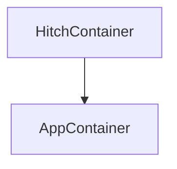
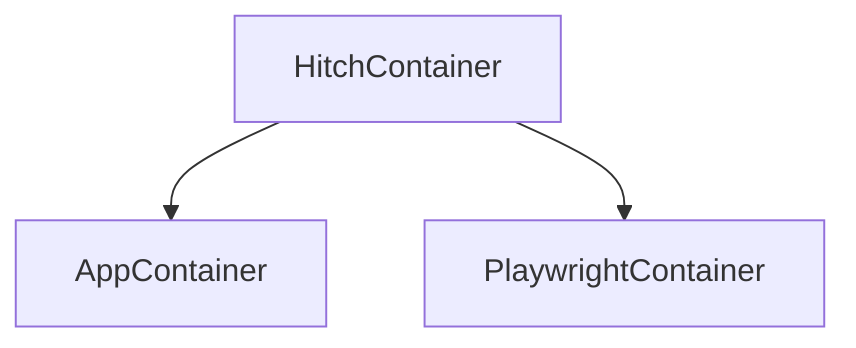

# HitchStory Examples

This repo contains four to do apps, each tested with
[HitchStory](https://hitchdev.com/hitchstory), a
[StrictYAML based](https://hitchdev.com/hitchstory/why/strictyaml)
FOSS python integration testing framework.

Unlike other testing frameworks these terse, simple, type-safe stories can:

## Rewrite themselves based upon program output

## Generate documentation

<table>
  <tr>
    <td>Web (YAML story -> Markdown docs)</td>
    <td>REST API (story -> docs)</td>
    <td>Interactive CLI (story -> docs)</td>
    <td>Python API (story -> docs)</td>
  </tr>
  <tr>
    <td> </td>
    <td></td>
    <td></td>
    <td></td>
  </tr>
 </table>

To do App | Storytests | Cool Features | Story Engine | Doc template
---|---|---|---|---
Website | [add todo](https://github.com/hitchdev/hitchstory/tree/master/examples/website/story/add-todo.story), [correct spelling](https://github.com/hitchdev/hitchstory/tree/master/examples/website/story/correct-my-spelling.story) | [Autogenerated add todo docs](https://github.com/hitchdev/hitchstory/blob/main/website/docs/add-and-retrieve-todo.md) and [correct my spelling](https://github.com/hitchdev/hitchstory/tree/master/examples/website/docs/correct-my-spelling.md) docs including playwright generated GIFs and screenshots. | [engine.py](https://github.com/hitchdev/hitchstory/tree/master/examples/website/hitch/engine.py) | [docstory.yml](https://github.com/hitchdev/hitchstory/tree/master/examples/website/hitch/docstory.yml)
REST API | [add todo](https://github.com/hitchdev/hitchstory/tree/master/examples/restapi/story/add-todo.story), [correct spelling](https://github.com/hitchdev/hitchstory/tree/master/examples/restapi/story/correct-my-spelling.story) | [Autogenerated docs](https://github.com/hitchdev/hitchstory/tree/master/examples/restapi/docs), API responses in story self-rewrite | [engine.py](https://github.com/hitchdev/hitchstory/tree/master/examples/restapi/hitch/engine.py)  | [docstory.yml](https://github.com/hitchdev/hitchstory/tree/master/examples/restapi/hitch/docstory.yml)
Interactive command line app | [add todo](https://github.com/hitchdev/hitchstory/tree/master/examples/commandline/story/add-todo.story), [correct spelling](https://github.com/hitchdev/hitchstory/tree/master/examples/commandline/story/correct-my-spelling.story) | [Autogenerated docs](https://github.com/hitchdev/hitchstory/tree/master/examples/commandline/docs), Command line outputs in story self-rewrite | [engine.py](https://github.com/hitchdev/hitchstory/tree/master/examples/commandline/tests/engine.py) | [docstory.yml](https://github.com/hitchdev/hitchstory/tree/master/examples/commandline/tests/docstory.yml)
Python API | [add todo](https://github.com/hitchdev/hitchstory/tree/master/examples/pythonapi/story/add-todo.story), [correct spelling](https://github.com/hitchdev/hitchstory/tree/master/examples/pythonapi/story/correct-my-spelling.story) | [Autogenerated docs](https://github.com/hitchdev/hitchstory/tree/master/examples/pythonapi/docs), print() outputs from python in stories self-rewrites | [engine.py](https://github.com/hitchdev/hitchstory/tree/master/examples/pythonapi/hitch/engine.py) | [docstory.yml](https://github.com/hitchdev/hitchstory/tree/master/examples/pythonapi/hitch/docstory.yml)

## Run them yourself

It's very simple. You just need to install podman and run two commands
to try it out.

The commands are in the READMEs of each folder:

* [Website](https://github.com/hitchdev/hitchstory/tree/master/examples/website).
* [REST API](https://github.com/hitchdev/hitchstory/tree/master/examples/restapi).
* [Command Line App](https://github.com/hitchdev/hitchstory/tree/master/examples/commandline).
* [Python API](https://github.com/hitchdev/hitchstory/tree/master/examples/pythonapi).

# Github Actions

All of the above projects are tested on github actions with
the same two steps - `./run.sh make` and `./run.sh pytest`. See here:

* [Github actions YAML](https://github.com/hitchdev/hitchstory/blob/master/.github/workflows/examples.yml)
* [Runner](https://github.com/hitchdev/hitchstory/actions/workflows/examples.yml)

# About the projects

The four folders contain four versions of the same project -
[this great little to do app](https://github.com/ovinokurov/ToDo)
built by [Oleg Vinokurov](https://github.com/ovinokurov) which was built
with a command line, REST and web interface.

For the pythonapi project everything is just run in the Hitch container (test and code-under-test in separate virtualenvs).

The interactive command line app and REST API have a podman-in-podman:

While the website app is tested with a parent hitch container building and running the app and playwright containers:

This is done to segregate the test code from the application code.

# Future work on this repo

- [ ] Integrate containerized postgres running with all of the apps, seeded with [given preconditions](https://hitchdev.com/hitchstory/using/given/).
- [ ] Mock the passage of time with a step - implement reminders into the to do apps.
- [ ] Handle a REST API response which returns a different UUID each time it is called.
- [ ] Demonstrate story inheritance (e.g. logging in story -> add todo) using all of the [currently documented inheritance features listed here](https://hitchdev.com/hitchstory/using/).

Have suggestions? What kind of gnarly integration tests would you find most interesting? Raise an issue if you have more ideas.
