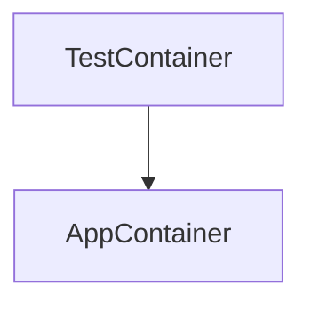

# REST API Tests with HitchStory

This project contains a sample REST API project that demonstrates
a few end to REST API end test best practices with hitchstory:

* Rewritable stories: if the REST API response is modified in code, running the test in rewrite mode will rewrite the response in the test.
* The handling of fields whose outputs vary upon each test run (UUID, timestamp).
* Rewritable documentation: templated generation of readable markdown docs demonstrating user stories with API snippets (useful for BDD).
* Absolute environmental consistency and portability via podman-in-podman (the test container orchestrates app container) and dependency pinning.
* Every project task performable via one script (`./run.sh`).
* One step build and set up (`./run.sh make`).
* Simplified continuous integration.

## Set up

**Podman must be installed on your system first.**

All other functionality is automated and can be run via one of the 
four run.sh scripts.

To begin:

```bash
$ git clone https://github.com/hitchdev/hitchstory.git
$ cd hitchstory/examples/restapi
$ ./run.sh make  # builds one local container and volume, and one container inside it
```


## Clean up everything

Everything runs in one podman container and volume. This deletes them:

```
$ ./run.sh clean all
```

# Github Actions

These integration tests are run via github actions on every push (along with the tests for 3 other projects). The steps are kept deliberately
simple to prevent a CI debugging explosion.

* [Github actions YAML](https://github.com/hitchdev/hitchstory/blob/master/.github/workflows/examples.yml)
* [Runner](https://github.com/hitchdev/hitchstory/actions/workflows/examples.yml)

# Architecture

The tests in this project are run from a podman container and the REST API is run in a container run *inside* that container:


