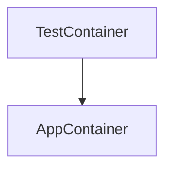

# REST API Tests with Pytest, HitchStory and Podman

<div align="center">
  <div style="display: flex;">
    
    
  </div>
</div>

This example project demonstrates a combination of best practices and state of the art practices for isolated REST API tests:

* One step set up: `./run.sh make`.
* Absolute and total environmental consistency and portability (Mac/WSL/Linux) via containerization, dependency pinning and container-in-container (podman-in-podman).
* Every project task runnable via one script (./run.sh) - building, running tests, generating docs, re-pinning dependencies.
* Handling of fields whose outputs change upon each test run (UUID, timestamp).
* Rewritable stories: if the REST API response is modified in code, running the test in rewrite mode will rewrite the response in the test.
* Rewritable documentation: [templated](https://github.com/hitchdev/hitchstory/blob/master/examples/restapi/tests/docstory.yml) generation of [readable markdown docs](https://github.com/hitchdev/hitchstory/blob/master/examples/restapi/docs/add-and-retrieve-todo.md) demonstrating user stories with API snippets (useful for BDD).
* Ultra simple 2 step [github actions config](https://github.com/hitchdev/hitchstory/blob/master/.github/workflows/examples.yml) to run all of the tests.

It is a work in progress. These are some features I'll be adding soon:

- [ ] Database fixtures - copied from the website example https://github.com/hitchdev/hitchstory/blob/master/examples/website/
- [ ] Use of podman-compose - also copied from  https://github.com/hitchdev/hitchstory/blob/master/examples/website/
- [ ] Validation of UUID and timestamp (e.g. via regex).

## Set up

**Podman must be installed on your system first.**

All other functionality is automated and can be run via one of the 
four run.sh scripts.

To begin:

```bash
$ git clone https://github.com/hitchdev/hitchstory.git
$ cd hitchstory/examples/restapi
$ ./run.sh make  # builds one local container and volume, and one container inside it
```


## Clean up everything

Everything runs in one podman container and volume. This deletes them:

```
$ ./run.sh clean all
```

# Github Actions

These integration tests are run via github actions on every push (along with the tests for 3 other projects). The steps are kept deliberately
simple to prevent a CI debugging explosion.

* [Github actions YAML](https://github.com/hitchdev/hitchstory/blob/master/.github/workflows/examples.yml)
* [Runner](https://github.com/hitchdev/hitchstory/actions/workflows/examples.yml)

# Architecture

The tests in this project are run from a podman container and the REST API is run in a container run *inside* that container:


