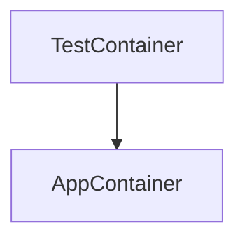

# HitchStory REST API Tests Example

## Run them yourself

**Podman must be installed on your system first.**

All other functionality is automated and can be run via one of the 
four run.sh scripts.

To begin:

```bash
$ git clone https://github.com/hitchdev/hitchstory.git
$ cd hitchstory/examples/restapi
$ ./run.sh make
```

`./run.sh make` downloads and builds the container and python packages the
tests need to run in an isolated environment for each of the respective projects.


## Run all tests

```
$ ./run.sh regression
```

## Run a single test

This command can be used to craft a new feature and do
acceptance test driven development on it:

```
$ ./run.sh atdd correct
```

"correct" is a unique keyword used in the name of one of the stories.

## Run singular test in rewrite mode

If you tweak the wordings in the command line app and run this, it will
update the story accordingly.

```
$ ./run.sh ratdd correct
```

## Generate documentation from stories

This will regenerate all of the markdown docs for the project:

```
$ ./run.sh docgen
```

## Clean up everything

Everything runs in one podman container and volume. This deletes them:

```
$ ./run.sh clean all
```

# Github Actions

These integration tests are run via github actions on every push. See here:

* [Github actions YAML](https://github.com/hitchdev/hitchstory/blob/master/.github/workflows/examples.yml)
* [Runner](https://github.com/hitchdev/hitchstory/actions/workflows/examples.yml)

# Architecture

The tests in this project are run from a podman container and the REST API is run in a container run *inside* that container:




# Future tweaks to this project

- [ ] Handle a REST API response which returns a different UUID each time it is called.
