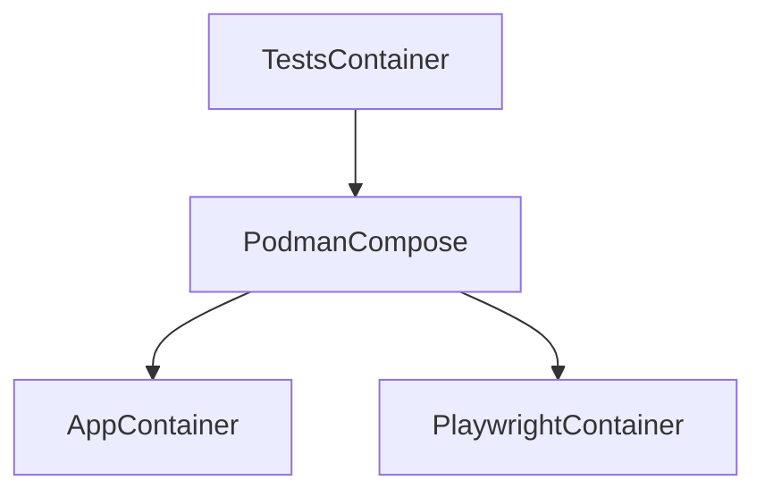

# Self-Rewriting Documentation Writing Playwright Tests with HitchStory


## The storytests on this project are different. They:

* Can rewrite themselves based upon program output.
* Autogenerate markdown documentation with video and screenshots.

## 3 step set up

**Podman must be installed on your system first.**

Followed by:

```bash
$ git clone https://github.com/hitchdev/hitchstory.git
$ cd hitchstory/examples/website
$ ./run.sh make     # builds one local container and volume, with containers inside it
```

Once `./run.sh make` has completed successfully you can start running tests.

## Run example self rewriting, self-documenting test

The [correct my spelling test](https://github.com/hitchdev/hitchstory/blob/master/examples/website/story/correct-my-spelling.story) checks that an error message appears:

```yaml
Correct my spelling:
  ...
  steps:
  ...
  - should appear:
      text: Did you mean 'buy bread'?
      on: error
```

If you try changing this error message [in the code](https://github.com/hitchdev/hitchstory/blob/master/examples/website/app/todos/views.py#L38).

```python
{
    "error_message": "Did you mean '{}'?".format(
        correct_spelling(title)
    )
},
```

To this:

```python
{
    "error_message": "Are you sure? Did you mean '{}'?".format(
        correct_spelling(title)
    )
},
```

And run the [test](https://github.com/hitchdev/hitchstory/blob/master/examples/website/story/correct-my-spelling.story) that covers it in rewrite mode:

```
$ STORYMODE=rewrite ./run.sh pytest -k test_correct_my_spelling
```

This will update the text in the step. e.g.

```
  - should appear:
      on: error
      text: Are you sure? Did you mean 'buy bread'?
```

It will also re-record the video, re-take the story screenshots and
regenerate [the corresponding markdown documentation](https://github.com/hitchdev/hitchstory/blob/master/examples/website/docs/correct-my-spelling.md) for the story.

## How?

The code that rewrites the story is [in the should_appear method in test_integration.py](https://github.com/hitchdev/hitchstory/blob/master/examples/website/tests/test_integration.py#LL104C14-L104C14).

The same class also contains code for recording video and


## Additional features on this repo:

* The entire environment can be set up with one script and runs rootless inside one podman container and volume.
* The browser tests can run in headless mode or with VNC.
* The tests generate screenshots which are used for snapshot testing (comparing pixel by pixel) and used in the markdown docs.
* The database fixtures can be written in-story.
* Everything runs rootless using podman-in-podman.
* No magic but still a very small amount of code required.

The app under test is built in Django, but it can in theory test any combination of services that can be run with a docker-compose.yaml file.


## Run all the tests

```
$ ./run.sh pytest
```

## Run a single test

This runs "Add and retrieve todo" from `story/add-todo.story` in normal mode:

```
$ ./run.sh pytest -k test_add_and_retrieve_todo
```


## Run test in vnc mode on localhost:5901

This can be useful for debugging a test, using right-click-inspect element
or doing some exploratory QA at any point in the story:

```
$ STORYMODE=vnc ./run.sh pytest -k test_add_and_retrieve_todo
```

It will pause and launch an ipython prompt once the test passes or fails.

## Kill test

If a running test freezes and ctrl-C doesn't work, you can run this command to stop the container:

```
$ ./run.sh kill
```

## Generate documentation from stories

This will regenerate all of the markdown docs for the project from the stories.

```
$ ./run.sh python tests/docgen.py
```

## Clean up everything

Everything runs in one podman container and volume. This deletes them:

```
$ ./run.sh clean all
```

# Github Actions

These integration tests are run via github actions on every push. The Github
Actions YAML is strictly kept as simple as possible so that it doesn't have to
be debugged.

See here:

* [Github actions YAML](https://github.com/hitchdev/hitchstory/blob/master/.github/workflows/examples.yml)
* [Runner](https://github.com/hitchdev/hitchstory/actions/workflows/examples.yml)

# Architecture

The tests in this project are run from a single podman container. The playwright container and the website are run in a container run *inside* that container:



This keeps the environment running the testing code completely consistent across
environments and enables some sophisticated caching to speed up builds.


# Future improvements to this project coming soo:

- [ ] Integrate containerized postgres running with all of the apps, seeded with data from given - making use of story inheritance.
- [ ] Mock the passage of time with a step - e.g. implement reminders into the to do apps.
- [ ] Add selectors specified in the story (hidden in the docs). Demonstrate "autogenerated" selectors alongside custom selectors.
- [ ] Cache podman make on github actions.
- [ ] Parallelize the test runners.

