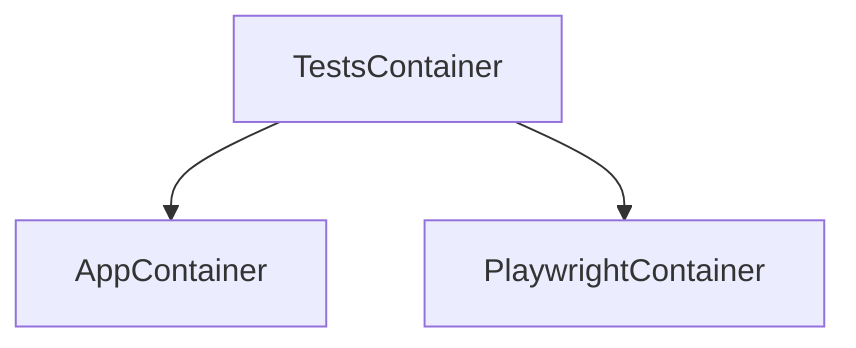

# HitchStory Website Tests Example

## Run them yourself

**Podman must be installed on your system first.**

All other functionality is automated and can be run via one of the 
four run.sh scripts.

To begin:

```bash
$ git clone https://github.com/hitchdev/hitchstory.git
$ cd hitchstory/examples/website
$ ./run.sh make
```

> **Note**
> Everything runs solely one podman container and volume.


## Run all the tests

```
$ ./run.sh pytest
```

## Run a single test

This runs "Add and retrieve todo" from `story/add-todo.story`:

```
$ ./run.sh pytest -k test_add_and_retrieve_todo
```

## Run singular test in rewrite mode

If you change some wordings in the command line app and run this, it will
re-take the screenshots and GIF video recordings:

```
$ STORYMODE=rewrite ./run.sh pytest -k test_add_and_retrieve_todo
```

## Generate documentation from stories

This will regenerate all of the markdown docs for the project:

```
$ ./run.sh docgen
```

## Clean up everything

Everything runs in one podman container and volume. This deletes them:

```
$ ./run.sh clean all
```

# Github Actions

These integration tests are run via github actions on every push. See here:

* [Github actions YAML](https://github.com/hitchdev/hitchstory/blob/master/.github/workflows/examples.yml)
* [Runner](https://github.com/hitchdev/hitchstory/actions/workflows/examples.yml)

# Architecture

The tests in this project are run from a single podman container. The playwright container and the website are run in a container run *inside* that container:





# Future improvements to this project

- [ ] Integrate containerized postgres running with all of the apps, seeded with data from given.
- [ ] Mock the passage of time with a step - e.g. implement reminders into the to do apps.
- [ ] Demonstrate story inheritance (e.g. logging in story -> add todo).
- [ ] Some weird selectors specified in the story (hidden in the docs).
