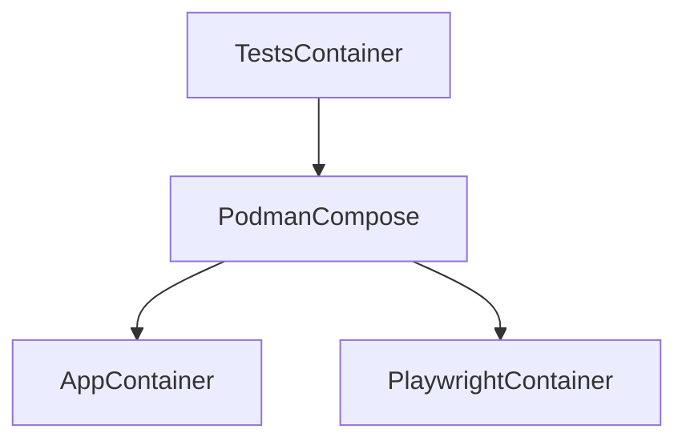

# End to End Tests with Playwright, Pytest and Hitchstory

This example project demonstrates a combination of **best practices** and **state of the art practices** for isolated **end to end web app testing**:

* One step set up: `./run.sh make`.
* Built in snapshot testing on browser screenshots.
* Absolute and total environmental consistency and portability (Mac/WSL/Linux) via containerization and dependency pinning.
* Tests can be easily run in headless mode or with VNC so you can interact with a GUI.
* Services under test all run via podman-compose-in-podman.
* Every project task runnable via one script (`./run.sh`) - building, running tests, generating docs, re-pinning dependencies.
* Database fixtures which can be trivially configured in-story.
* Database fixtures which are cached as podman volumes after being built for faster test runs.
* Built in multibrowser - use "given a chromium browser" to "given a firefox browser" on the story and both just work.
* Integrated debugging: show all logs for the app under test as well as clear stack traces.
* On test failures: save artefacts - a screenshot, a video of the failed test, the HTML at the point of failure and a "diff" screenshot if the test failed on a snapshot step.
* Ultra simple 3 step github actions config to run all of the tests (& upload any artefacts).
* Explicitly waiting for ports to open before kicking off the test (eliminates a common source of flakiness).
* Easy in-test debugging (via ipython).

Along with new state of the art features enabled by hitchstory:

* Autogeneration of beautiful markdown documentation based upon tests using user-defined templates - complete with screenshots and playable GIFs of the story.
* The tests can rewrite themselves from program output - change the text of an error message, run the test in rewrite mode and the step that validates the message updates itself (see example below).
* Type safe high level user stories.
* Database fixtures from one story can be re-used in another story via story inheritance.

It is a work in progress. These are some practices I'll be adding soon:

- [ ] Demonstrating the use of postgres (rather than sqlite).
- [ ] Mocking the passage of time with a step - e.g. implement a reminders feature into the to do app and show it in action.
- [ ] Add selectors specified in the story (hidden in the docs). Demonstrate "autogenerated" selectors alongside custom selectors.
- [ ] Aggressive caching on github actions while keeping the config as simple as possible.
- [ ] Aggressive parallelization end to end test runs on github actions while keeping the config as simple as possible.
- [ ] Proxied external API calls in live and recorded mode (probably via mitmproxy).

## One step set up

**Podman must be installed on your system first.**

Followed by:

```bash
$ git clone https://github.com/hitchdev/hitchstory.git
$ cd hitchstory/examples/website
$ ./run.sh make     # builds one local container and volume, with containers inside it
```

Once `./run.sh make` has completed successfully you can start running tests.

## Run example self rewriting, self-documenting test

The [correct my spelling test](https://github.com/hitchdev/hitchstory/blob/master/examples/website/story/correct-my-spelling.story) checks that an error message appears:

```yaml
Correct my spelling:
  ...
  steps:
  ...
  - should appear:
      text: Did you mean 'buy bread'?
      on: error
```

If you try changing this error message [in the code](https://github.com/hitchdev/hitchstory/blob/master/examples/website/app/todos/views.py#L38).

```python
{
    "error_message": "Did you mean '{}'?".format(
        correct_spelling(title)
    )
},
```

To this:

```python
{
    "error_message": "Are you sure? Did you mean '{}'?".format(
        correct_spelling(title)
    )
},
```

And run the [test](https://github.com/hitchdev/hitchstory/blob/master/examples/website/story/correct-my-spelling.story) that covers it in rewrite mode:

```
$ STORYMODE=rewrite ./run.sh pytest -k test_correct_my_spelling
```

This will update the text in the step. e.g.

```
  - should appear:
      on: error
      text: Are you sure? Did you mean 'buy bread'?
```

It will also re-record the video, re-take the story screenshots and
regenerate [the corresponding markdown documentation](https://github.com/hitchdev/hitchstory/blob/master/examples/website/docs/correct-my-spelling.md) for the story.

## How?

The code that rewrites the story is [in the should_appear method in test_integration.py](https://github.com/hitchdev/hitchstory/blob/master/examples/website/tests/test_integration.py#LL104C14-L104C14).


## Run all the tests

```
$ ./run.sh pytest
```

## Run a single test

This runs "Add and retrieve todo" from `story/add-todo.story` in normal mode:

```
$ ./run.sh pytest -k test_add_and_retrieve_todo
```


## Run test in vnc mode on localhost:5901

This can be useful for debugging a test, using right-click-inspect element
or doing some exploratory QA at any point in the story:

```
$ STORYMODE=vnc ./run.sh pytest -k test_add_and_retrieve_todo
```

It will pause and launch an ipython prompt once the test passes or fails.

## Kill test

If a running test freezes and ctrl-C doesn't work, you can run this command to stop the container:

```
$ ./run.sh kill
```

## Generate documentation from stories

This will regenerate all of the markdown docs for the project from the stories.

```
$ ./run.sh python tests/docgen.py
```

## Debugging the tests (e.g. step code)

There are probably a few ways to do this. The one I find the most
useful is to embed ipython in a step like so `__import__("IPython").embed()`.
At this point everything on the Engine is accessible via self - e.g. `self.given['browser']`.

You can also put a `- pause` step in any of the stories and it will do the same
thing.

You can use this to experiment with playwright until you've got the code you
need to put into an actual step.

## Debugging the code

I find the easiest way with this set up is to `import web_pdb ; web_pdb.set_trace()` and then to view https://localhost:5555/ with a browser.


## Clean up everything

Everything runs in one podman container and volume. This deletes them:

```
$ ./run.sh clean all
```

# Github Actions

These integration tests are run via github actions on every push. The Github
Actions YAML is strictly kept as simple as possible so that it doesn't have to
be debugged.

See here:

* [Github actions YAML](https://github.com/hitchdev/hitchstory/blob/master/.github/workflows/example-website.yml)
* [Runner](https://github.com/hitchdev/hitchstory/actions/workflows/example-website.yml)

# Architecture

The tests in this project are run from a single podman container. The playwright container and the website are run in a container run *inside* that container:



This keeps the environment running the testing code completely consistent across
environments and enables some sophisticated caching to speed up builds.


